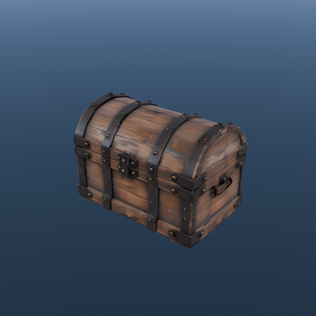
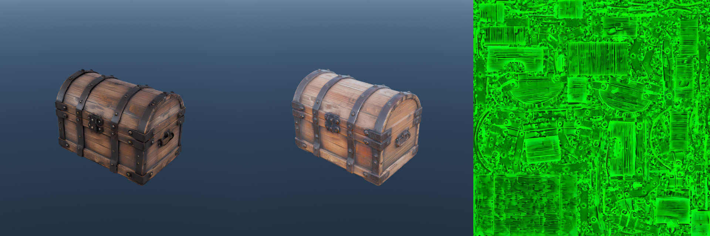
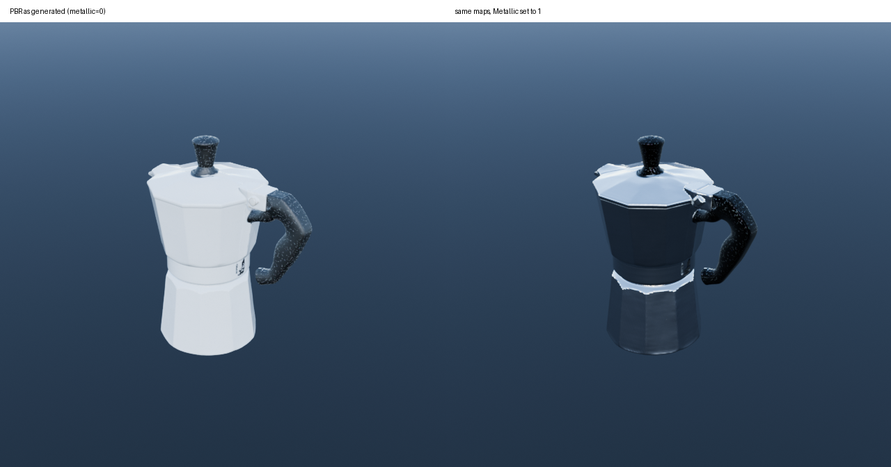

# blender-hunyuan3d-mac

**Textured 3D asset generation inside Blender, entirely on an Apple Silicon Mac.** No CUDA, no cloud
API, no keys. An image goes in, a textured mesh lands in your scene — about 6½ minutes at the
default quality, or 95 seconds with `HY3D_QUALITY=fast` while you iterate.



BlenderMCP's Hunyuan3D panel has a **LOCAL_API** mode that POSTs to `http://localhost:8081/generate`
and expects raw GLB bytes back — but ships no server to answer it. This is that server, wired to
[Hunyuan3D-Swift](https://github.com/ZimengXiong/Hunyuan3D-Swift), Zimeng Xiong's MLX/Metal port of
Tencent's shape **and paint** pipelines.

```
Blender addon (:9876) ──POST /generate──▶ bridge.py (:8081) ──▶ hy3d shape (MLX)   ~45s
                      ◀──── GLB bytes ────                  └──▶ hy3d paint (MLX)  ~5m45s
```

It starts with Blender, stops with Blender, and needs nothing running in the background otherwise.

## Why this exists

Every other route to Hunyuan3D on a Mac is either shape-only or CUDA-only:

| route | on Apple Silicon |
|---|---|
| ComfyUI's native Hunyuan3D nodes | shape only, ~180s, no texture |
| `kijai/ComfyUI-Hunyuan3DWrapper` | rasterizer wheels are CUDA-only |
| `visualbruno/ComfyUI-Hunyuan3d-2-1` | no Mac path |
| `Brainkeys/Hunyuan3D-2.1-mac` | runs with `--disable_tex` |
| **this + Hunyuan3D-Swift** | **shape + texture, ~90s total** |

## Requirements

- Apple Silicon Mac, macOS 14+. ~40GB of free memory during texture generation.
- Blender with [BlenderMCP](https://github.com/ahujasid/blender-mcp) installed and its server started.
- Xcode / Swift toolchain (to build the MLX engine) and `git`, `python3`, `curl`.
  The bridge is stdlib-only on purpose: Blender's environment may resolve `python3` to Xcode's
  (3.9 here) rather than your Homebrew one. Verified on both 3.9 and 3.14.
- ~20GB of disk for weights (15GB if you skip `shape-large` and run `HY3D_QUALITY=fast`).

## Install

```bash
git clone https://github.com/larattalabs/blender-hunyuan3d-mac.git
cd blender-hunyuan3d-mac

# 1. weights (~20GB) — both shape models + both paint models
hf download zimengxiong/hunyuan3d-mlx-shape-large --local-dir ~/AI/hunyuan3d-mlx/weights/shape-large
hf download zimengxiong/hunyuan3d-mlx-shape-small --local-dir ~/AI/hunyuan3d-mlx/weights/shape-small
hf download zimengxiong/hunyuan3d-mlx-paint-small --local-dir ~/AI/hunyuan3d-mlx/weights/paint-small
hf download zimengxiong/hunyuan3d-mlx-paint-large --local-dir ~/AI/hunyuan3d-mlx/weights/paint-large

# 2. clone + build the MLX engine, plant its Metal library, assemble the weights root
./setup.sh

# 3. have Blender start the endpoint for you
./install_blender.sh
```

Restart Blender. The Hunyuan3D panel will already be enabled, set to LOCAL_API, pointed at
`http://localhost:8081`, with "Generate Texture" ticked. Give it an image and hit generate.

To run the endpoint by hand instead: `./serve.sh` (then `curl localhost:8081/health`).

## Two traps `setup.sh` handles for you

Worth knowing about, because both fail confusingly if you wire this up yourself:

1. **SwiftPM never builds MLX's Metal kernels.** `hy3d` dies instantly with *"Failed to load the
   default metallib"* — including under `swift run`. It needs `mlx.metallib` sitting next to the
   binary; `setup.sh` copies one out of any Python `mlx` install (keep versions close, mlx-swift
   pins MLX 0.31.x).
2. **The paint weights layout differs from the upstream README.** `Pipeline.swift` wants a root
   containing `hunyuan3d-paint-v2-0/`, `hunyuan3d-paintpbr-v2-1/`, `dinov2-giant/` and
   `realesrgan/`, but the HuggingFace bundles ship flat. `setup_paint_weights.sh` stitches them with
   symlinks — no bytes copied. **RGB paint needs `paint-small`**; `paint-large` alone can't do it.

## The input preprocessing is not optional

Hunyuan3D strips the background before conditioning. ComfyUI's nodes don't, and skipping it fails
*spectacularly* — the same clean mushroom reference on flat grey produced floating sheets at 20
steps and a **solid cube** at 30. Matted onto white and cropped, it came back perfect.

So the bridge always runs `prep_image.py` first: composite alpha (or key out a flat background) onto
white, crop to the subject, pad square with ~8% margin, resize to 768. It helps good inputs too — a
treasure chest went from 123k to 222k vertices with visibly crisper bands and rivets.

**Practical consequence:** give it a subject on a plain background. A busy photo background is left
alone (there's no matting model here) and will be reconstructed as geometry — cut the subject out
first. If a mesh comes back as sheets or a block, look at the input image, not at `steps`.

## RGB vs PBR

`--model rgb` (default) bakes lighting into the colour: great straight out, slightly painted-on.
`--model pbr` returns a de-lit 4096² albedo plus a metallic-roughness map, so the asset relights.



**The metallic channel comes back ≈0** — measured across subjects with obvious metal (a chest: max
0.28, mean 0.02; a stainless moka pot: max 0.48, mean 0.00). Roughness is genuinely informative
(moka mean 0.10, correctly glossy) and the channel packing follows the glTF spec, so this is the
model being conservative, not a broken map. A metal asset therefore renders as a chalky dielectric
until you set Metallic yourself — at which point the roughness map does its job:



```python
b = next(n for n in mat.node_tree.nodes if n.type == "BSDF_PRINCIPLED")
for l in [l for l in mat.node_tree.links if l.to_socket == b.inputs["Metallic"]]:
    mat.node_tree.links.remove(l)
b.inputs["Metallic"].default_value = 1.0
```

Rule of thumb: **rgb for wood, stone, fabric and organic props; pbr when the asset must relight or
is metal** — and expect to set Metallic by hand in the metal case.

## Quality presets

`HY3D_QUALITY=high` (**default**) or `fast`, or per request `{"quality": "fast"}`:

| preset | shape | paint | time | what changes |
|---|---|---|---|---|
| **`high`** (default) | `shape-large`, octree 384 | res 768, 25 steps, 4096² | ~6.5 min | separated fine parts, crisp perforations and rivets |
| `fast` | `shape-small`, octree 256 | res 512, 15 steps, 2048² | ~95 s | soft detail — fine parts merge. Good for iterating on the reference image |

`high` is the default because the difference isn't subtle: on a hurricane lantern it turns a fused
wire cage into separate wires and blank collar into visible rivets. Iterate on the reference image
with `fast`, then run the keeper at `high`.

Individual overrides: `shape_model` (`small`/`large`), `paint_res`, `paint_steps`, `paint_tex` per
request, or `HY3D_PAINT_RES` / `_STEPS` / `_TEX` / `HY3D_SHAPE_WEIGHTS_LARGE` in the environment.
If `shape-large` isn't downloaded, the `high` preset falls back to `shape-small` for shape and still
paints at high resolution — no error, just less geometric detail.

**Shape output is capped before painting.** At octree 512 a bushy subject can reach 4M faces, which
kills the paint stage (xatlas unwrap + 4096² bake) — an oak did exactly that. The bridge now counts
faces straight from the GLB header and decimates over-budget meshes to `HY3D_MAX_SHAPE_FACES`
(default 1.5M, ~16s) first. Paint quality is unaffected; the texture carries the detail.

**Where texture detail goes:** paint renders six views weighted `front 1.0, back 0.5, left/right 0.1,
top/bottom 0.05`. Generate from the angle the asset will be seen from — sides come out softer than
the back, and top/bottom faces are nearly unpainted.

## Command line

```bash
./scripts/image_to_3d.sh ref.png out.glb 256 30 rgb   # image → textured GLB (5th arg: rgb|pbr|none)
./scripts/preview.sh out.glb preview.png              # headless render, so you can see the result
./scripts/make_reference.sh "a weathered treasure chest with iron bands" ref.png 3
```

`make_reference.sh` is optional — it drives a local [Krea 2 Turbo MLX](https://github.com/avlp12/krea2_alis_mlx)
install to produce reference images with 3D-friendly framing. Any image works; bring your own.

## Game assets

A generated mesh is not a game asset — a lantern arrives at 1,006,732 tris. But the alarming part
of that (47,870 "islands", 27% non-manifold edges) is **an artefact of the paint stage**, not broken
geometry: hy3d unwraps with xatlas and exports the mesh split along every UV seam. Painting a bare
tree took it from 46 islands to 5,425 with the face count unchanged. Weld those seams back
(`Merge by Distance`) and the lantern is 6 islands with **zero** non-manifold edges.

That one step changes everything downstream: before welding, a 15k decimation request stalled at
20,579 tris and shredded the texture; after it, decimation lands exactly on budget and carries the
original UVs and texture through untouched.

```bash
./scripts/gameify.sh model.glb model_game.glb 15000 2048
```

**Default (`--mode decimate`)**: weld UV seams → triangulate → decimate to budget → drop metallic
→ resize the texture to `--tex`. Keeps the original texture and UVs. A couple of seconds. Measured:

| asset | source | islands as-shipped | islands welded | game-ready | file |
|---|---|---|---|---|---|
| stone lantern | 1,006,732 tris | 47,870 | **6** | 15,000 | 8.0 MB |
| pine | 607,564 | 29,832 | **21** | 15,000 | 8.6 MB |
| oak | 1,980,060 | 94,061 | **67** | 15,000 | 9.9 MB |
| bare spindly tree | 135,348 | 5,743 | **29** | 14,999 | 8.5 MB |

`--mode remesh` is the fallback: voxel remesh → decimate → fresh UVs → bake albedo, AO and a
tangent-space normal map off the dense original (~6s). It gives uniform, watertight topology, but
re-projects the texture and rounds off thin features — the spindly tree loses fine twigs there
while the decimate path keeps them. Use it only when a welded mesh still refuses to decimate.

The dense mesh is the **bake source**, not the deliverable — its detail lives on in the normal map.
That is the real argument for generating at `high`.

**Thin structures** are what separates the two paths. The decimate path keeps every branch of the
spindly tree; the remesh path rounds off anything near voxel size (at the old `size/200` default it
shattered that tree into 373 fragments — now `size/400`, 41). A few genuinely detached twigs come
out of the *shape* stage itself (46 islands at octree 384, 36 at 512) — that is the SDF resolution
limit, and a finer octree is the only real lever. Hero assets still want hand retopo.

## Getting better results

Three things were measured against each other on a deliberately hard subject (a bare, spindly tree,
where thin branches come out detached):

| lever | effect on disconnected pieces |
|---|---|
| **seed** | **17 / 25 / 33 / 33 / 56 islands across five seeds** — by far the strongest |
| octree 384 → 512 | 46 → 36 |
| marching-cubes isolevel (`--level -0.02`) | 36 → 34; over-dilating (-0.4) makes it *worse* at 47 |
| more steps / higher guidance | no measurable change |

So for anything spindly, it is a lottery worth re-rolling: `best_shape.sh ref.png out.glb 3` runs
three seeds (~30s each) and keeps the least fragmented. `hy3d shape --level` is exposed by a local
patch to Hunyuan3D-Swift (`MarchingCubes.extract` had the isolevel hardcoded to 0.0).

**Budget by subject, not by habit.** 15k tris is plenty for a lantern and far too few for a 6 m oak
canopy — foliage wants 40–80k, or it reads as faceted shards close up. `gameify.sh` smooths by
angle (`--smooth`, default 75°) which hides the shading facets, but not the silhouette.

**What no setting fixes:** the shape model cannot represent needles or leaves. A pine comes out as
lumpy masses with small spines no matter the octree or step count (verified at 512/50 steps) — the
texture does the work. For convincing conifers, generate the trunk and branch structure and add
foliage cards in Blender, or pick stylised subjects that suit blobby geometry.

## Materials arrive dielectric

glTF's spec default for `metallicFactor` is **1.0**, and hy3d's writer omits the factors — so every
painted asset is *pure metal* unless corrected. Dense meshes hide it (they mostly reflect
themselves); a smooth low-poly one mirrors the sky and reads pale blue. The bridge now patches the
GLB before returning it, and `gameify.sh` forces dielectric unless a real metallic texture is
present. If you use `hy3d` directly, set Metallic to 0 yourself.

## Measured on an M5 Max

| step | time |
|---|---|
| reference image (Krea 2 Turbo, 768²) | ~25 s |
| shape, `shape-large`, 40 steps, octree 384 (default) | ~45 s |
| shape, `shape-small`, 30 steps, octree 256 (`fast`) | **~11 s** |
| shape via the ComfyUI fallback | ~180 s |
| texture, RGB at res 768 / 25 steps / 4096² (default) | ~5m45 s |
| texture, RGB at res 512 / 15 steps / 2048² (`fast`) | ~72 s |
| texture, PBR (4096² albedo + MR, `fast` render settings) | ~114 s |
| **image → textured mesh, default `high`** | **~6.5 min** |
| **image → textured mesh, `fast`** | **~95 s** |

Peak memory during paint is ~38GB. Run one job at a time.

## Limits

- **Image-conditioned only.** There is no text→3D at the endpoint; a text-only request returns an
  explicit error. Generate an image first.
- **Blender's UI freezes during generation.** The addon's request has no timeout and blocks its
  socket handler. Expected, not a hang.
- **Straight-on views make bad meshes.** A head-on shot of a flat object gives the model almost no
  shape information — a front-facing pocket watch came back as 1,148 vertices. Use a 3/4 view.

## Configuration

| var | default | meaning |
|---|---|---|
| `HY3D_QUALITY` | `high` | `high` or `fast` — see Quality presets |
| `HY3D_SHAPE_BACKEND` | `auto` | `mlx`, `comfy`, or auto (MLX when its weights exist) |
| `HY3D_PAINT_MODEL` | `rgb` | `rgb` or `pbr` |
| `HY3D_SHAPE_WEIGHTS` / `HY3D_PAINT_WEIGHTS` | `~/AI/hunyuan3d-mlx/weights/…` | weight roots |
| `HY3D_PAINT_BIN` | `~/AI/hunyuan3d-mlx/.build/release/hy3d` | the MLX binary |
| `HY3D_MAX_SHAPE_FACES` | `1500000` | decimate the shape before painting if it exceeds this (0 disables) |
| `HY3D_PREPROCESS` | `1` | input matte/crop |
| `HY3D_PORT` | `8081` | bridge port (must match the addon's API URL) |
| `BLENDERMCP_HUNYUAN3D_AUTOSTART` | `1` | let Blender start/stop the endpoint |
| `BLENDERMCP_HUNYUAN3D_TEXTURE` | `1` | default state of the panel's texture checkbox |
| `BLENDERMCP_HUNYUAN3D_STEPS` / `_OCTREE` / `_GUIDANCE` | `40` / `384` / `5.5` | panel defaults per file |

A ComfyUI fallback for the shape stage is included (`HY3D_SHAPE_BACKEND=comfy`) for machines without
the MLX engine built. It's slower and can't texture; you shouldn't need it.

## Using it with a coding agent

[`skill/SKILL.md`](skill/SKILL.md) is an [agent skill](https://docs.claude.com/en/docs/agents-and-tools/agent-skills)
covering the whole loop — reference-image prompting rules, parameters, importing and cleaning up the
mesh in Blender, and how to tell a bad input from a bad setting. Drop it in `~/.claude/skills/` for
Claude Code, `~/.codex/skills/` for Codex, or read it yourself; the prompting section is the part
that decides whether meshes come out usable.

## Credits

- [Hunyuan3D-Swift](https://github.com/ZimengXiong/Hunyuan3D-Swift) — the MLX/Metal port that makes
  texture generation possible on Apple Silicon. This repo is a thin bridge; that's the hard part.
- [Tencent Hunyuan3D](https://github.com/Tencent-Hunyuan/Hunyuan3D-2.1) — the models.
- [BlenderMCP](https://github.com/ahujasid/blender-mcp) — the Blender addon and its LOCAL_API hook.

## Licence

The bridge and scripts here are MIT (see [LICENSE](LICENSE)). **The models are not.** Hunyuan3D
weights are covered by the Tencent Hunyuan Community Licence, which among other terms **prohibits
use in the EU, the UK and South Korea** and requires a separate licence above 1M monthly active
users. You download the weights yourself and are responsible for complying with their terms.
